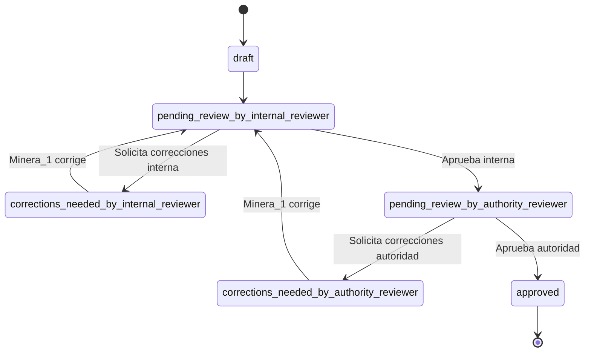

# CSE Cloud - Sistema de Formularios Configuración Sitio Específica

## 📋 Resumen Técnico

---

## 🔄 Flujo de revisión y correcciones (actualizado)

El flujo de revisión de formularios en CSE Cloud es el siguiente:

1. **Creación:**
   - El usuario `minera_1` (creator) crea y completa el formulario.
2. **Revisión interna:**
   - El usuario `minera_3` (internal_reviewer) revisa el formulario.
   - Puede aprobarlo para pasar a la autoridad o solicitar correcciones.
3. **Correcciones internas:**
   - Si `minera_3` solicita correcciones, el formulario pasa a `corrections_needed_by_internal_reviewer`.
   - Solo `minera_1` puede editar y corregir.
   - Al reenviar, vuelve a revisión interna.
4. **Revisión por autoridad:**
   - Si la revisión interna es aprobada, el formulario pasa a `pending_review_by_authority_reviewer`.
   - El usuario `autoridad_2` (authority_reviewer) revisa.
   - Puede aprobar definitivamente o solicitar correcciones.
5. **Correcciones solicitadas por autoridad:**
   - Si la autoridad solicita correcciones, el formulario pasa a `corrections_needed_by_authority_reviewer`.
   - Solo `minera_1` puede editar y corregir.
   - Al reenviar, el formulario **debe volver primero a revisión interna** (`pending_review_by_internal_reviewer`).
   - `minera_3` revisa nuevamente. Si aprueba, recién ahí vuelve a la autoridad.
   - El ciclo se repite hasta la aprobación final.

### Diagrama de estados simplificado



### Matriz de roles y permisos por estado

| Estado del Formulario                   | creator (minera_1) | internal_reviewer (minera_3) | authority_reviewer (autoridad_2) |
|-----------------------------------------|--------------------|------------------------------|-----------------------------------|
| draft                                  | Editar             | No acceso                    | No acceso                         |
| pending_review_by_internal_reviewer     | Lectura            | Revisión completa            | No acceso                         |
| corrections_needed_by_internal_reviewer | Corregir pasos     | Lectura                      | No acceso                         |
| pending_review_by_authority_reviewer    | Lectura            | Lectura                      | Revisión completa                 |
| corrections_needed_by_authority_reviewer| Corregir pasos     | Lectura                      | Lectura                           |
| approved                               | Lectura            | Lectura                      | Lectura                           |

---


CSE Cloud es un backend para gestión de formularios multi-tenant desarrollado sobre Cloudflare Workers. Está diseñado para manejar formularios de configuración específica para sitios mineros, con un flujo de trabajo que incluye creación, revisión interna y aprobación por autoridades.

### Características Principales

- **Arquitectura Serverless**: Basada en Cloudflare Workers para alta disponibilidad y bajo costo
- **Multi-tenant**: Aislamiento completo de datos por cliente mediante Durable Objects
- **Flujo de trabajo configurable**: Sistema de estados y transiciones para el proceso de aprobación
- **Autorización granular**: Control de acceso basado en roles y atributos
- **Almacenamiento persistente**: Estado duradero sin necesidad de base de datos externa
- **Integración vía API REST**: Endpoints bien definidos para todas las operaciones

## 🏗️ Arquitectura General

El backend está diseñado como un **monolito modular** desplegado sobre **Cloudflare Workers**, con lógica y estado segregados por cliente gracias al uso de **Durable Objects (DO)**.

Cada formulario CSE es una entidad aislada por `clientId`, permitiendo:

* **Multi-tenant nativo**: Datos completamente aislados por cliente
* **Estado persistente por cliente**: Cada cliente tiene su propio Durable Object
* **Escalabilidad horizontal**: Los Workers escalan automáticamente
* **Seguridad basada en atributos**: Control de acceso granular

### Diagrama de Componentes

```
┌─────────────────────────────────────┐
│            Frontend MFE             │
└───────────────┬─────────────────────┘
                │
                ▼
┌─────────────────────────────────────┐
│         API REST (Hono.js)          │
├─────────────────────────────────────┤
│    Autenticación / Autorización     │
├─────────────────────────────────────┤
│          Lógica de Negocio          │
└───────────────┬─────────────────────┘
                │
                ▼
┌─────────────────────────────────────┐
│  Durable Objects (Estado por cliente)│
└───────────────┬─────────────────────┘
                │
                ▼
┌──────────┬────┴─────┬───────────────┐
│ R2 Files │   Queues │  Otros Servicios │
└──────────┴──────────┴───────────────┘
```

## 🔐 Seguridad: Autenticación y Autorización

* **JWT externo**: generado por un sistema de login no modificable
* Se extrae del `localStorage` del host en el frontend y se envía al backend como `Authorization: Bearer`
* **Autenticación con JWT + verificación con `SESSION_SECRET`**
* **Autorización híbrida (RBAC + ABAC)**:
  * RBAC: Basado en el `sub` → rol (ej: `minera_1` → `creator`)
  * ABAC: Basado en `clientId`, `role`, `status`, y tipo de acción

## 👥 Roles y Permisos

| Usuario (`sub`) | Rol funcional (`role`) | Permisos principales |
| --------------- | ---------------------- | -------------------- |
| `minera_1`      | `creator`              | Crea, edita pasos, envía a revisión interna |
| `minera_3`      | `internal_reviewer`    | Revisa pasos, sugiere correcciones, aprueba para autoridad |
| `autoridad_2`   | `authority_reviewer`   | Revisa paso a paso, solicita correcciones, aprueba y despacha el formulario completo |

## 🔄 Flujo del Formulario CSE

### Estados del formulario global

* `draft`
* `pending_review_by_internal_reviewer`
* `corrections_needed_by_internal_reviewer`
* `pending_review_by_authority_reviewer`
* `corrections_needed_by_authority_reviewer`
* `approved`

### Estados del paso individual

* `incomplete`
* `completed`
* `needs_correction`

## 🧱 Componentes Principales

### Durable Objects

#### CSEDurableObject
* DO por cliente: `cse-${clientId}`
* Guarda:
  * Estado del formulario
  * Todos los pasos
  * Comentarios por paso
  * Historial de cambios de estado

#### CSEIndexDurableObject
* DO global: `global-index`
* Mantiene un índice centralizado de todos los formularios
* Permite consultas eficientes por estado a nivel global
* Facilita la visualización de formularios pendientes para autoridades

### Rutas REST (via Hono)

#### Rutas para Clientes (acceso por clientId)

| Método | Ruta                                                  | Función                              | Roles con acceso |
| ------ | ----------------------------------------------------- | ------------------------------------ | ---------------- |
| GET    | `/cse/:clientId`                                      | Obtiene todo el estado del CSE       | Todos (con permisos) |
| POST   | `/cse/:clientId/steps/:stepId`                        | Guarda/actualiza un paso             | creator |
| POST   | `/cse/:clientId/submit`                               | Enviar formulario a revisión interna | creator |
| POST   | `/cse/:clientId/internal-review/approve`              | Aprueba internamente                 | internal_reviewer |
| POST   | `/cse/:clientId/internal-review/request-corrections`  | Solicita correcciones internas       | internal_reviewer |
| POST   | `/cse/:clientId/authority-review/approve`             | Aprueba final                        | authority_reviewer |
| POST   | `/cse/:clientId/authority-review/request-corrections` | Solicita correcciones autoridad      | authority_reviewer |

#### Rutas para Autoridad (acceso global)

| Método | Ruta                                | Función                                      | Roles con acceso |
| ------ | ----------------------------------- | -------------------------------------------- | ---------------- |
| GET    | `/api/authority/pending-forms`      | Lista todos los formularios pendientes de revisión | authority_reviewer |
| GET    | `/api/authority/forms/:clientId`    | Obtiene los detalles de un formulario específico | authority_reviewer |

## 📦 Despacho Final

Al aprobar el formulario, el backend despacha vía **Cloudflare Queues**:

* A un backend del cliente (`CLIENT_DISPATCH_QUEUE`)
* A un backend de la autoridad (`AUTHORITY_DISPATCH_QUEUE`)

## 🛠 Stack Tecnológico

| Capa             | Tecnología                               |
| ---------------- | ---------------------------------------- |
| Runtime          | Cloudflare Workers                       |
| Framework        | Hono (TypeScript)                        |
| Persistencia     | Durable Objects (por `clientId`)         |
| Colas            | Cloudflare Queues                        |
| Archivos         | R2 (temporal)                            |
| Validación       | Zod                                      |
| Seguridad        | JWT + RBAC + ABAC                        |

## 🌍 Ambientes definidos

* `dev` — desarrollo local/test
* `lab` — staging con datos reales o simulados
* `prod` — producción final

## 💻 Guía de Uso

### Instalación y Configuración

1. **Clonar el repositorio e instalar dependencias**:

```bash
git clone <url-del-repositorio>
cd cse-cloud
pnpm install
```

2. **Configurar variables de entorno**:

Editar el archivo `wrangler.jsonc` para configurar los secretos y variables de entorno:

```json
"vars": {
  "ENVIRONMENT": "dev",
  "SESSION_SECRET": "tu-secreto-seguro-para-jwt",

  "INTERNAL_INDEX_BASE_URL": "https://internal/index",
  "INTERNAL_FORM_BASE_URL": "https://internal/form"
}
```

También puedes crear un archivo `.env` en la raíz del proyecto para desarrollo local (este archivo no se sube al repositorio):

```
# URLs internas para comunicación entre Durable Objects
INTERNAL_INDEX_BASE_URL=https://internal/index
INTERNAL_FORM_BASE_URL=https://internal/form
```

3. **Desarrollo local**:

```bash
pnpm dev
```

Esto iniciará el servidor en `http://localhost:8787`

### Interacción con la API

#### Autenticación

Todas las peticiones deben incluir un token JWT válido en el header de autorización:

```
Authorization: Bearer <tu-token-jwt>
```

El token debe contener:
- `sub`: ID del usuario (ej: `minera_1`)
- `role`: Rol del usuario (`creator`, `internal_reviewer`, `authority_reviewer`)
- `clientId`: ID del cliente al que pertenece el usuario

#### Ejemplos de Uso

1. **Obtener el estado actual de un formulario**:

```bash
curl -X GET \
  http://localhost:8787/cse/cliente123 \
  -H 'Authorization: Bearer <tu-token-jwt>'
```

2. **Actualizar un paso del formulario**:

```bash
curl -X POST \
  http://localhost:8787/cse/cliente123/steps/paso1 \
  -H 'Authorization: Bearer <tu-token-jwt>' \
  -H 'Content-Type: application/json' \
  -d '{
    "data": {
      "campo1": "valor1",
      "campo2": "valor2"
    },
    "status": "completed"
  }'
```

3. **Enviar a revisión interna**:

```bash
curl -X POST \
  http://localhost:8787/cse/cliente123/submit \
  -H 'Authorization: Bearer <tu-token-jwt>'
```

4. **Aprobar revisión interna**:

```bash
curl -X POST \
  http://localhost:8787/cse/cliente123/internal-review/approve \
  -H 'Authorization: Bearer <tu-token-jwt>'
```

5. **Solicitar correcciones**:

```bash
curl -X POST \
  http://localhost:8787/cse/cliente123/internal-review/request-corrections \
  -H 'Authorization: Bearer <tu-token-jwt>' \
  -H 'Content-Type: application/json' \
  -d '{
    "comments": [
      {
        "stepId": "paso1",
        "text": "Por favor corregir este campo"
      }
    ]
  }'
```

### Integración con Frontend

El frontend debe:

1. Extraer el token JWT del `localStorage` del host
2. Incluir el token en todas las peticiones al backend
3. Manejar los diferentes estados del formulario y mostrar la interfaz adecuada según el rol del usuario

### Flujo de Trabajo Completo

1. **Creator**: Crea y completa los pasos del formulario
2. **Creator**: Envía el formulario a revisión interna
3. **Internal Reviewer**: Revisa y aprueba o solicita correcciones
4. **Creator**: Realiza correcciones si son solicitadas
5. **Authority Reviewer**: Revisa y aprueba o solicita correcciones
6. **Creator**: Realiza correcciones finales si son solicitadas
7. **Authority Reviewer**: Aprueba el formulario
8. **Sistema**: Despacha el formulario aprobado a las colas correspondientes

## 🚀 Despliegue

### Despliegue en Diferentes Ambientes

```bash
# Despliegue en desarrollo
pnpm deploy:dev

# Despliegue en laboratorio
pnpm deploy:lab

# Despliegue en producción
pnpm deploy:prod
```

### Consideraciones de Seguridad para Producción

- Cambiar el `SESSION_SECRET` por un valor seguro y único
- Configurar correctamente los permisos de acceso a los Durable Objects
- Utilizar Workers for Enterprise para características avanzadas de seguridad
- Implementar rate limiting para prevenir abusos
- Monitorear el uso y errores mediante Sentry u otra herramienta similar

Pass the `CloudflareBindings` as generics when instantiation `Hono`:

```ts
// src/index.ts
const app = new Hono<{ Bindings: CloudflareBindings }>()
